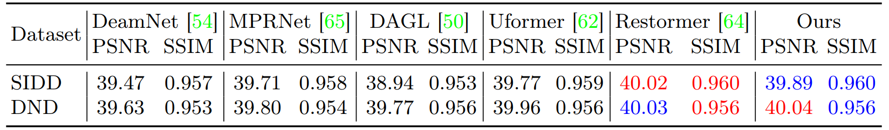

<p align="center">
    
</p>

## MambaIR: A Simple Baseline for Image Restoration with State-Space Model

[[Paper](https://arxiv.org/abs/2402.15648)] [[Zhihu(知乎)](https://zhuanlan.zhihu.com/p/684248751)]


[Hang Guo](https://github.com/csguoh)\*, [Jinmin Li](https://github.com/THU-Kingmin)\*, [Tao Dai](https://cstaodai.com/), Zhihao Ouyang, Xudong Ren, and [Shu-Tao Xia](https://scholar.google.com/citations?hl=zh-CN&user=koAXTXgAAAAJ)

(\*) equal contribution

> **Abstract:**  Recent years have witnessed great progress in image restoration thanks to the advancements in modern deep neural networks e.g. Convolutional Neural Network and Transformer. However, existing restoration backbones are usually limited due to the inherent local reductive bias or quadratic computational complexity. Recently, Selective Structured State Space Model e.g., Mamba, have shown great potential for long-range dependencies modeling with linear complexity, but it is still under-explored in low-level computer vision. In this work, we introduce a simple but strong benchmark model, named MambaIR, for image restoration. In detail, we propose the Residual State Space Block as the core component, which employs convolution and channel attention to enhance capabilities of the vanilla Mamba. In this way, our MambaIR takes advantages of local patch recurrence prior as well as channel interaction to produce restoration-specific feature representation. Extensive experiments demonstrate the superiority of our method, for example, MambaIR outperforms Transformer-based baseline SwinIR by up to 0.36dB, using similar computational cost but with global receptive field. 


<p align="center">
    
</p>

⭐If this work is helpful for you, please help star this repo. Thanks!🤗


## 📑 Contents

- [Visual Results](#visual_results)
- [News](#news)
- [TODO](#todo)
- [Model Summary](#model_summary)
- [Results](#results)
- [Installation](#installation)
- [Training](#training)
- [Testing](#testing)
- [Citation](#cite)


## <a name="Real-SR"></a>🔍 Visual Results On Real-world SR

[](https://imgsli.com/MjQ4MzQz) [](https://imgsli.com/MjQ4MzQ2) [](https://imgsli.com/MjQ4MzQ3)

[](https://imgsli.com/MjQ4MzQ5) [](https://imgsli.com/MjQ4MzUx) [](https://imgsli.com/MjQ4MzUz)


## <a name="visual_results"></a>:eyes:Visual Results On Classic Image SR

<p align="center">
  
</p>


## <a name="news"></a> 🆕 News

- **2024-2-23:** arXiv paper available.
- **2024-2-27:** This repo is released.
- **2024-3-01:** Pretrained weights for SR and realDN is available. :tada:
- **2024-3-08:** The code for ERF visualization and model complexity analysis can be found at `./analysis/` 😄
- **2024-3-19:** We have updated the code for MambaIR-light. Training with only DIV2K, it can achieve better performance (outperform SRFormer by up to **0.2dB**)
- **2024-3-19:** 🔈🔈🔈**BIG NEWS：** **The FIRST Mamba-based Real-world SR Model** is now available! Enjoy yourself 😊.


## <a name="todo"></a> ☑️ TODO

- [x] Build the repo
- [x] arXiv version
- [x] Release code
- [x] Pretrained weights&log_files
- [x] Add code for complexity analysis and ERF visualization
- [x] Real-world SR
- [ ] Guassian Color Image Denosing
- [ ] Add Download Link for Visual Results on Common Benckmarks
- [ ] JPEG Compression Artifact Redection
- [ ] More Tasks
 

## <a name="model_summary"></a> :page_with_curl: Model Summary

| Model          | Task                 | Test_dataset | PSNR  | SSIM   | model_weights | log_files |
|----------------|----------------------|--------------|-------|--------| --------- | -------- |
| MambaIR_SR2    | Classic SR x2        | Urban100     | 34.15 | 0.9446 | [link](https://drive.google.com/file/d/11Kiy_0hmMyDjMvW7MmbUT6tO9n5JrDeB/view?usp=sharing)      | [link](https://drive.google.com/file/d/1XzBkBPPb5jymKfGQO3yVePVqWxDMuaF1/view?usp=sharing)     |
| MambaIR_SR3    | Classic SR x3        | Urban100     | 29.93 | 0.8841 | [link](https://drive.google.com/file/d/1u0VcESEduHu-GBCC6vDGQt9qXSX2AKdn/view?usp=sharing)      | [link](https://drive.google.com/file/d/1cmMwVLfoUiPVlF9uokk1LM6GBpsewZp0/view?usp=sharing)     |
| MambaIR_SR4    | Classic SR x4        | Urban100     | 27.68 | 0.8287 | [link](https://drive.google.com/file/d/1YXggWIsi-auCjmPQDvW9FjB1f9fZK0hN/view?usp=sharing)      | [link](https://drive.google.com/file/d/18clazq4oVfiQwgPyqRwS3k89htbg3Btg/view?usp=sharing)     |
| MambaIR_light2 | Lightweight SR x2    | Urban100     | 32.92 | 0.9356 | [link](https://drive.google.com/file/d/1kMCxoD-WEWaLcADJ7ZKV5B7jPpiYBkC2/view?usp=sharing)      | [link](https://drive.google.com/file/d/14cyT7vCvbCjWrtlYzFhXKc0OVBccRFU6/view?usp=sharing)     |
| MambaIR_light3 | Lightweight SR x3    | Urban100     | 29.00 | 0.8689 | [link](https://drive.google.com/file/d/1emoHPdBca99_7yx09kuTOCXU3nMOnBY-/view?usp=sharing)      | [link](https://drive.google.com/file/d/1a_zIDyyQA69ZsZiKOubj2EpvLCnH_9pO/view?usp=sharing)     |
| MambaIR_light4 | Lightweight SR x4    | Urban100     | 26.75 | 0.8051 | [link](https://drive.google.com/file/d/1Qv_jTuP2P5tTaGQ8SgQuB7W9Cl-YPqH5/view?usp=sharing)      | [link](https://drive.google.com/file/d/1W7jbbyao7d9Jw3AY9MEIt_eW-od92Seq/view?usp=sharing)     |
| MambaIR_realDN | Real image Denoising | SIDD         | 39.89 | 0.960  | [link](https://drive.google.com/file/d/1iMcapgaT7VPfR2UFYy21KbX3rUHFJCU8/view?usp=sharing)      | [link](https://drive.google.com/file/d/1FZ0ZOw5gXRs1hGMzm_21QDs0q_3rCtix/view?usp=sharing)     |
| MambaIR_realSR | Real-world SR        | RealSRSet    | -     | -      | [link](https://drive.google.com/file/d/1ZOFzcex2g9_B6Xtf8-qnMx08OnAjKD0M/view?usp=sharing)      | [link](https://drive.google.com/file/d/13KNqh3WCn-Lx4gJ8X1K9l8MRERjjcqGw/view?usp=sharing)     |


## <a name="results"></a> 🥇 Results

We achieve state-of-the-art performance on various image restoration tasks. Detailed results can be found in the paper.


<details>
<summary>Evaluation on Classic SR (click to expand)</summary>

<p align="center">
  
</p>
</details>


<details>
<summary>Evaluation on Lightweight SR (click to expand)</summary>

<p align="center">
  
</p>
</details>


<details>
<summary>Evaluation on Real Image Denoising (click to expand)</summary>

<p align="center">
  
</p>

</details>


<details>
<summary>Evaluation on Effective Receptive Filed (click to expand)</summary>

<p align="center">
  
</p>

</details>


## <a name="installation"></a> :wrench: Installation

This codebase was tested with the following environment configurations. It may work with other versions.

- Ubuntu 20.04
- CUDA 11.7
- Python 3.9
- PyTorch 1.13.1 + cu117

To use the selective scan with efficient hard-ware design, the `mamba_ssm` library is advised to install with the folllowing command.

```
pip install causal_conv1d==1.0.0
pip install mamba_ssm==1.0.1
```

One can also create a new anaconda environment, and then install necessary python libraries with this [requirement.txt](https://drive.google.com/file/d/1SXtjaYDRN53Mz4LsCkgcL3wV23cOa8_P/view?usp=sharing) and the following command: 
```
conda install --yes --file requirements.txt
```


## <a name="training"></a>  :hourglass: Training

### Train on SR

1. Please download the corresponding training datasets and put them in the folder datasets/DF2K. Download the testing datasets and put them in the folder datasets/SR.

2. Follow the instructions below to begin training our model.

```
# Claissc SR task, cropped input=64×64, 8 GPUs, batch size=4 per GPU
python -m torch.distributed.launch --nproc_per_node=8 --master_port=1234 basicsr/train.py -opt options/train/train_MambaIR_SR_x2.yml --launcher pytorch
python -m torch.distributed.launch --nproc_per_node=8 --master_port=1234 basicsr/train.py -opt options/train/train_MambaIR_SR_x3.yml --launcher pytorch
python -m torch.distributed.launch --nproc_per_node=8 --master_port=1234 basicsr/train.py -opt options/train/train_MambaIR_SR_x4.yml --launcher pytorch

# Lightweight SR task, cropped input=64×64, 8 GPUs, batch size=8 per GPU
python -m torch.distributed.launch --nproc_per_node=8 --master_port=1234 basicsr/train.py -opt options/train/train_MambaIR_lightSR_x2.yml --launcher pytorch
python -m torch.distributed.launch --nproc_per_node=8 --master_port=1234 basicsr/train.py -opt options/train/train_MambaIR_lightSR_x3.yml --launcher pytorch
python -m torch.distributed.launch --nproc_per_node=8 --master_port=1234 basicsr/train.py -opt options/train/train_MambaIR_lightSR_x4.yml --launcher pytorch
```

3. Run the script then you can find the generated experimental logs in the folder experiments.

### Train on Real Denoising

1. Please download the corresponding training datasets and put them in the folder datasets/SIDD. Note that we provide both training and validating files, which are already processed.
2. Go to folder 'realDenoising'. Follow the instructions below to train our model.

``` 
# go to the folder
cd realDenoising
# set the new environment (BasicSRv1.2.0), which is the same with Restormer for training.
python setup.py develop --no_cuda_extgf
# train for RealDN task, 8 GPUs
python -m torch.distributed.launch --nproc_per_node=8 --master_port=2414 basicsr/train.py -opt options/train_MambaIR_RealDN.yml --launcher pytorch
Run the script then you can find the generated experimental logs in the folder realDenoising/experiments.
```

3. Remember to go back to the original environment if you finish all the training or testing about real image denoising task. This is a friendly hint in order to prevent confusion in the training environment.
```
# Tips here. Go back to the original environment (BasicSRv1.3.5) after finishing all the training or testing about real image denoising. 
cd ..
python setup.py develop
```


## <a name="testing"></a> :smile: Testing

### Test on SR

1. Please download the corresponding testing datasets and put them in the folder datasets/SR. Download the corresponding models and put them in the folder experiments/pretrained_models.

2. Follow the instructions below to begin testing our MambaIR model.
```
# test for image SR. 
python basicsr/test.py -opt options/test/test_MambaIR_SR_x2.yml
python basicsr/test.py -opt options/test/test_MambaIR_SR_x3.yml
python basicsr/test.py -opt options/test/test_MambaIR_SR_x4.yml
# test for lightweight image SR. 
python basicsr/test.py -opt options/test/test_MambaIR_lightSR_x2.yml
python basicsr/test.py -opt options/test/test_MambaIR_lightSR_x3.yml
python basicsr/test.py -opt options/test/test_MambaIR_lightSR_x4.yml
```


### Test on Real Image Denoising

1. Download the [SIDD test](https://drive.google.com/file/d/11vfqV-lqousZTuAit1Qkqghiv_taY0KZ/view) and [DND test](https://drive.google.com/file/d/1CYCDhaVxYYcXhSfEVDUwkvJDtGxeQ10G/view?usp=sharing). Place them in `datasets/RealDN`.  Download the corresponding models and put them in the folder `experiments/pretrained_models`. 
2. Go to folder 'realDenoising'. Follow the instructions below to test our model. The output is in `realDenoising/results/Real_Denoising`.
    ```bash
    # go to the folder
    cd realDenoising
    # set the new environment (BasicSRv1.2.0), which is the same with Restormer for testing.
    python setup.py develop --no_cuda_ext
    # test MambaIR (training total iterations = 300K) on SSID
    python test_real_denoising_sidd.py
    # test MambaIR (training total iterations = 300K) on DND
    python test_real_denoising_dnd.py
    ```
3. Run the scripts below to reproduce PSNR/SSIM on SIDD. 
   ```bash
   run evaluate_sidd.m
   ```
4. For PSNR/SSIM scores on DND, you can upload the genetated DND mat files to the [online server](https://noise.visinf.tu-darmstadt.de/) and get the results.

5. Remerber to go back to the original environment if you finish all the training or testing about real image denoising task. This is a friendly hint in order to prevent confusion in the training environment.
    ```bash
    # Tips here. Go back to the original environment (BasicSRv1.3.5) after finishing all the training or testing about real image denoising. 
    cd ..
    python setup.py develop
    ```


## <a name="cite"></a> 🥰 Citation

Please cite us if our work is useful for your research.

```
@article{guo2024mambair,
  title={MambaIR: A Simple Baseline for Image Restoration with State-Space Model},
  author={Guo, Hang and Li, Jinmin and Dai, Tao and Ouyang, Zhihao and Ren, Xudong and Xia, Shu-Tao},
  journal={arXiv preprint arXiv:2402.15648},
  year={2024}
}
```

## License

This project is released under the [Apache 2.0 license](LICENSE).

## Acknowledgement

This code is based on [BasicSR](https://github.com/XPixelGroup/BasicSR), [ART](https://github.com/gladzhang/ART) ,and [VMamba](https://github.com/MzeroMiko/VMamba). Thanks for their awesome work.

## Contact

If you have any questions, feel free to approach me at cshguo@gmail.com

