<p align="center">
    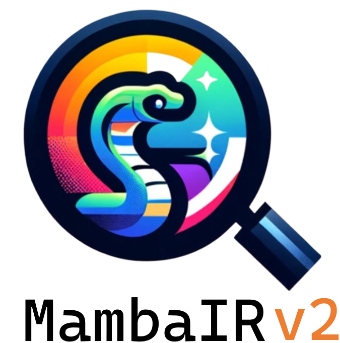
</p>


# News: MambaIRv2 is now available!
The updated MambaIRv2 is totally compatible with the previous MambaIR. We also keep the code of MambaIR in [another branch](https://github.com/csguoh/MambaIR/tree/mambair) for your possible revisiting.

### Check our paper collection of [Awesome Mamba in Low-Level Vision](https://github.com/csguoh/Awesome-Mamba-in-Low-Level-Vision) :hugs:.

## [ECCV24] MambaIR: A Simple Baseline for Image Restoration with State-Space Model

## MambaIRv2: Attentive State Space Restoration


[<a href="https://colab.research.google.com/drive/1BjTTPqnUKAa_Esh8ZD77TWiS7JrxQ8TR?usp=sharing"></a>](https://colab.research.google.com/drive/1BjTTPqnUKAa_Esh8ZD77TWiS7JrxQ8TR?usp=sharing)

#### [[Paper](https://arxiv.org/pdf/2411.15269)] [[Zhihu(知乎)](https://zhuanlan.zhihu.com/p/9375585949)]


[Hang Guo](https://github.com/csguoh)\*, [Yong Guo](https://www.guoyongcs.com/)\* [Yaohua Zha](https://scholar.google.com.hk/citations?user=-zUO4_QAAAAJ&hl=zh-CN&oi=sra), [Yulun Zhang](https://yulunzhang.com/) [Wenbo Li](https://fenglinglwb.github.io/), [Tao Dai](https://csse.szu.edu.cn/pages/user/index?id=1204), [Shu-Tao Xia](https://www.sigs.tsinghua.edu.cn/xst/list.htm), [Yawei Li](https://yaweili.bitbucket.io/)


(\*) equal contribution


> **Abstract:**   The Mamba-based image restoration backbones have recently demonstrated significant potential in balancing global reception and computational efficiency. However,  the inherent causal modeling limitation of Mamba, where each token depends solely on its predecessors in the scanned sequence, restricts the full utilization of pixels across the image and thus presents new challenges in image restoration. In this work, we propose MambaIRv2, which equips Mamba with the non-causal modeling ability similar to ViTs to reach the attentive state space restoration model. Specifically, the proposed attentive state-space equation allows to attend beyond the scanned sequence and facilitate image unfolding with just one single scan. Moreover, we further introduce a semantic-guided neighboring mechanism to encourage interaction between distant but similar pixels. Extensive experiments show our MambaIRv2 outperforms SRFormer by even 0.35dB PSNR for lightweight SR even with 9.3% less parameters and suppresses HAT on classic SR by up to 0.29dB


<p align="center">
    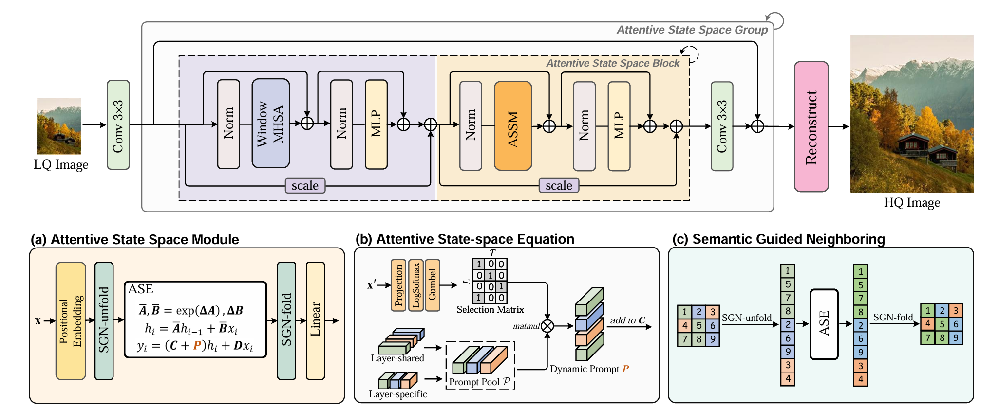
</p>

⭐If this work is helpful for you, please help star this repo. Thanks!🤗


## 📑 Contents

- [Visual Results](#visual_results)
- [News](#news)
- [TODO](#todo)
- [Model Summary](#model_summary)
- [Results](#results)
- [Installation](#installation)
- [Training](#training)
- [Testing](#testing)
- [Citation](#cite)


## <a name="Real-SR"></a>🔍 Real-world SR with MambaIR

[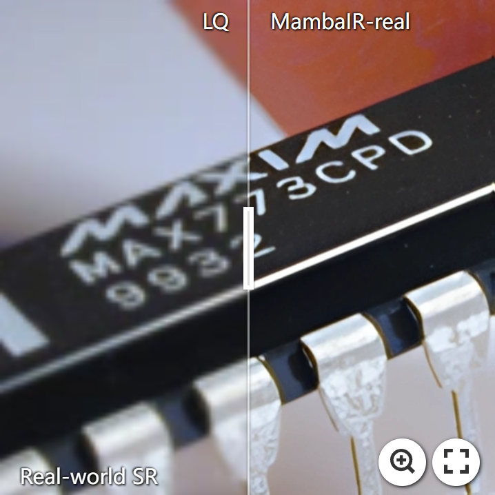](https://imgsli.com/MjQ4MzQz) [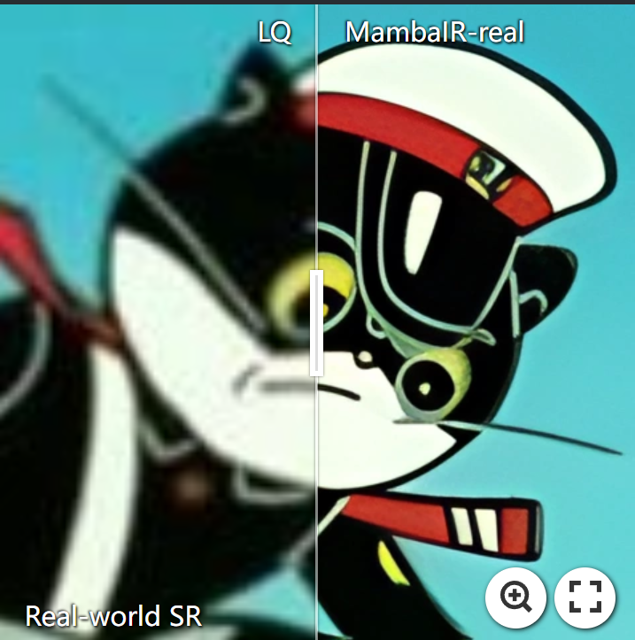](https://imgsli.com/MjQ4MzQ2) [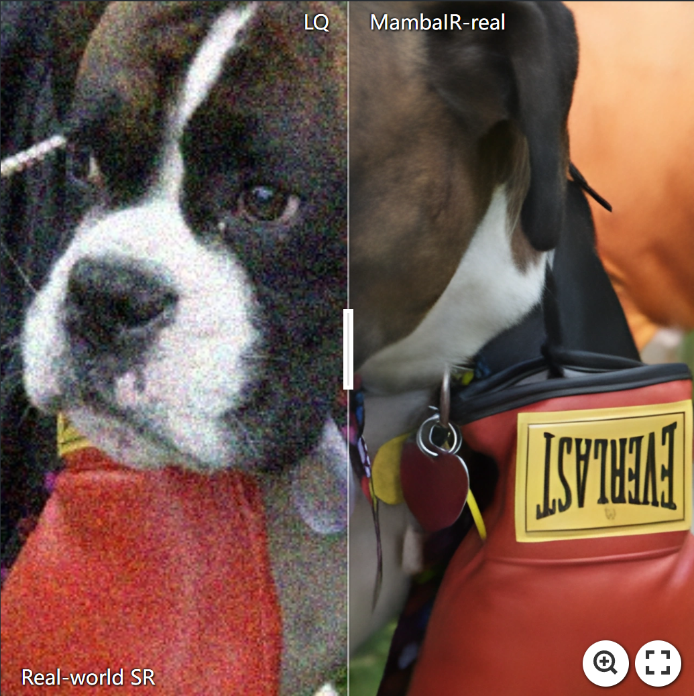](https://imgsli.com/MjQ4MzQ3)

[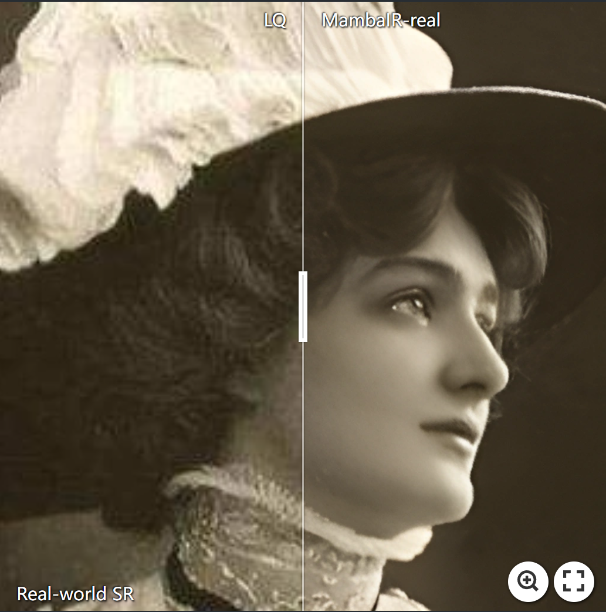](https://imgsli.com/MjQ4MzQ5) [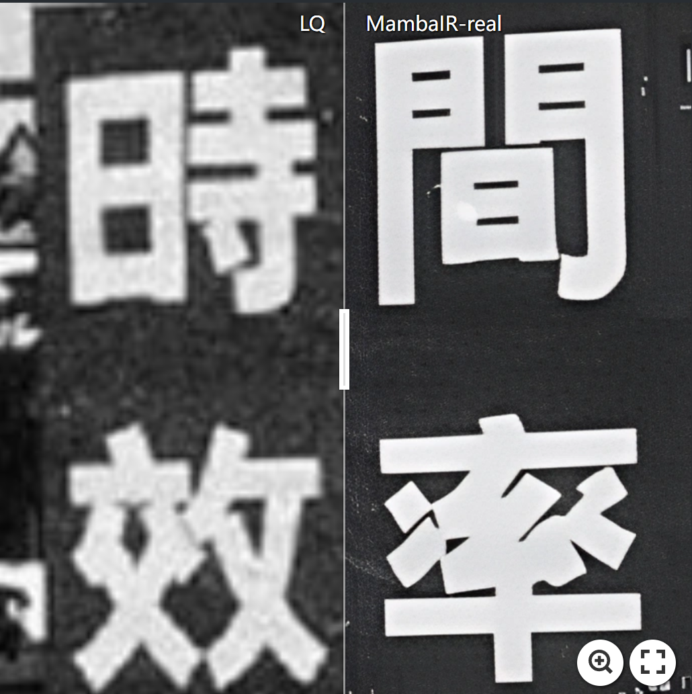](https://imgsli.com/MjQ4MzUx) [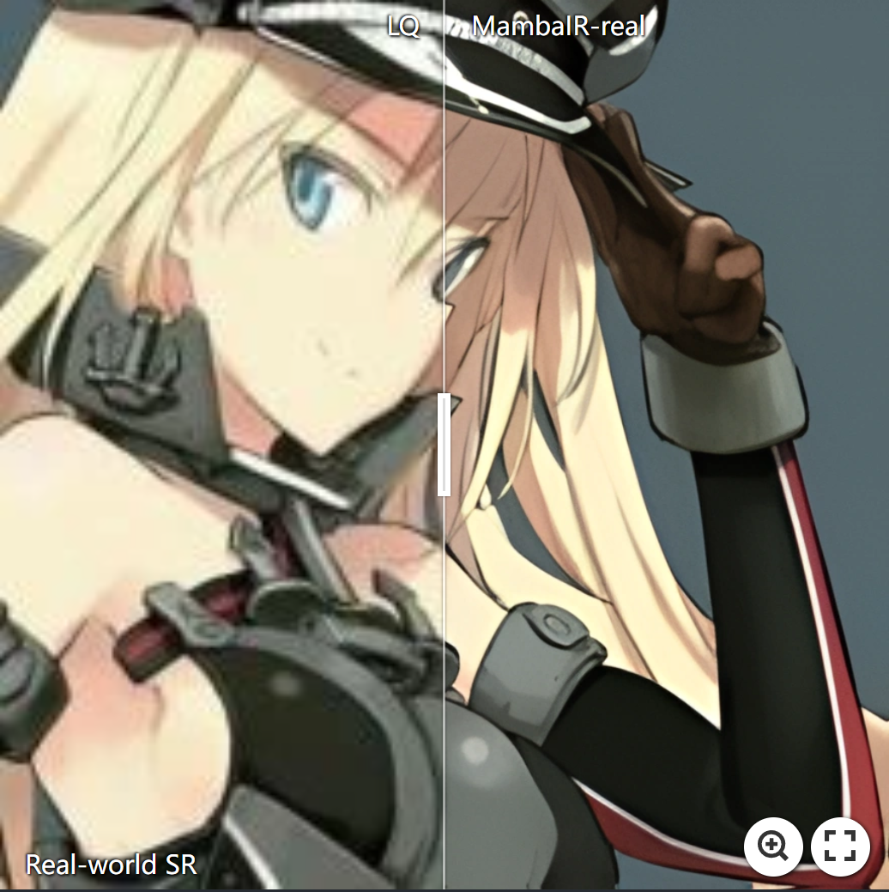](https://imgsli.com/MjQ4MzUz)


## <a name="visual_results"></a>:eyes:Visual Results On Classic Image SR

<p align="center">
  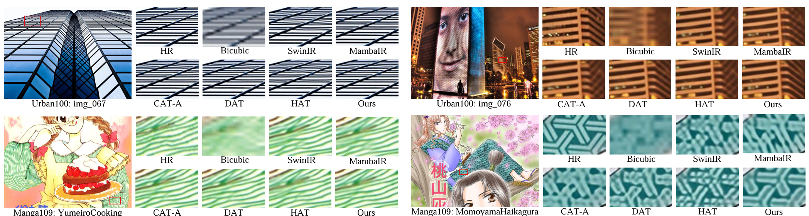
</p>


## <a name="news"></a> 🆕 News

- **2024-2-23:** arXiv paper available.
- **2024-2-27:** This repo is released.
- **2024-3-01:** Pretrained weights for SR and realDN is available. :tada:
- **2024-3-08:** The code for ERF visualization and model complexity analysis can be found at `./analysis/` 😄
- **2024-3-19:** We have updated the code for MambaIR-light. 
- **2024-3-19:** **The FIRST Mamba-based Real-world SR Model** is now available! Enjoy yourself 😊.
- **2024-05-24**:🔈🔈🔈We have released a new repository to collect recent works of **Mamba in low-level-vision**, please see [here](https://github.com/csguoh/Awesome-Mamba-in-Low-Level-Vision) if you are instersted ;D
- **2024-06-10**: We have released the training and testing config files for **Guassian Color Image Denoising**, the pre-trained weights are coming soon 👏
- **2024-06-10**: We have also updated the **environments installation** instruction [here](#installation) for fast building your own mamba environment for reproduce!
- **2024-07-01**: :fire: :fire: :fire: Congratulations! Our MambaIR has been accepted by **ECCV 2024**！
- **2024-07-04**: :kissing_heart: We have released the training and testing config files for JPEG compression artifact reduction tasks.
- **2024-07-04**: The pretrained weight for **Guassian Color Image Denosing** as well as **JPEG Compression Artifact Reduction** are now available [here](#model_summary). The performance of these models is futher improved than the reported one in the paper. And we will update the Arxiv version in the future. Enjoy these new models! :yum:
- **2024-08-19:** The previous #params&MACs calculation for Mamba model using the `thop` library has a bug, which was also discussed in [#issue44](https://github.com/csguoh/MambaIR/issues/44). We have updated the new accurate calculation code which uses `fvcore` and additionally registers the previous missing parameters. You can use this new code in `./analysis/flops_param_fvcore.py`for complexity analysis. Note that the model complexity obtained from this code is lager than the reported one. We will release a new comparable MambaIR-light model soon, stay tuned！
- **2024-10-15**: We have updated a new arXiv version of our MambaIR paper, in which we have fixed the results on lightSR tasks.
- **2024-10-15**😍😍😍A brand new Mamba-base image restoration backbone MambaIRv2 is just around the corner, with significant performance and efficiency improvements. We will release the new paper and code soon~
- **2024-12-04**: 🤗The code of **MambaIRv2 is now released**, with significant gains on both performance and efficiency!
- **2025-01-13**: 👀 We have created an **online jupyter notebook demo** for fast inference to play with the MambaIR model. Check our online inference demo here 👉 [<a href="https://colab.research.google.com/drive/1BjTTPqnUKAa_Esh8ZD77TWiS7JrxQ8TR?usp=sharing"></a>](https://colab.research.google.com/drive/1BjTTPqnUKAa_Esh8ZD77TWiS7JrxQ8TR?usp=sharing)
- **2025-02-27**: 🎉🎉🎉 Congrats! Our MambaIRv2 is accepted by **CVPR2025**!


## <a name="todo"></a> ☑️ TODO

- [x] Build the repo
- [x] arXiv version
- [x] Release code
- [x] Pretrained weights&log_files
- [x] Add code for complexity analysis and ERF visualization
- [x] Real-world SR
- [x] Guassian Color Image Deniosing
- [x] Add Download Link for Visual Results on Common Benchmarks
- [x] JPEG Compression Artifact Reduction
- [x] Release MambaIRv2 Code
- [x] Release pre-trained MambaIRv2 weights
- [x] Online jupyter notebobk demo
- [ ] Release U-shaped MambaIRv2 for more restoration tasks


## <a name="model_summary"></a> :page_with_curl: Model Summary

| Model          | Task                 | Test_dataset | PSNR  | SSIM   | model_weights | log_files |
|----------------|----------------------|--------------|-------|--------| --------- | -------- |
| MambaIR_SR2    | Classic SR x2        | Urban100     | 34.15 | 0.9446 | [link](https://drive.google.com/file/d/11Kiy_0hmMyDjMvW7MmbUT6tO9n5JrDeB/view?usp=sharing)      | [link](https://drive.google.com/file/d/1XzBkBPPb5jymKfGQO3yVePVqWxDMuaF1/view?usp=sharing)     |
| MambaIR_SR3    | Classic SR x3        | Urban100     | 29.93 | 0.8841 | [link](https://drive.google.com/file/d/1u0VcESEduHu-GBCC6vDGQt9qXSX2AKdn/view?usp=sharing)      | [link](https://drive.google.com/file/d/1cmMwVLfoUiPVlF9uokk1LM6GBpsewZp0/view?usp=sharing)     |
| MambaIR_SR4    | Classic SR x4        | Urban100     | 27.68 | 0.8287 | [link](https://drive.google.com/file/d/1YXggWIsi-auCjmPQDvW9FjB1f9fZK0hN/view?usp=sharing)      | [link](https://drive.google.com/file/d/18clazq4oVfiQwgPyqRwS3k89htbg3Btg/view?usp=sharing)     |
| MambaIR_light2 | Lightweight SR x2    | Urban100     | 32.92 | 0.9356 | [link](https://drive.google.com/file/d/1eWovtH7YvEn2Bm9wBK5REOhbIgapsLxM/view?usp=sharing)      | [link](https://drive.google.com/file/d/14cyT7vCvbCjWrtlYzFhXKc0OVBccRFU6/view?usp=sharing)     |
| MambaIR_light3 | Lightweight SR x3    | Urban100     | 29.00 | 0.8689 | [link](https://drive.google.com/file/d/1JoC3fwah5Xo0Z1s8DnmXQlsctKQjs1Hx/view?usp=sharing)      | [link](https://drive.google.com/file/d/1a_zIDyyQA69ZsZiKOubj2EpvLCnH_9pO/view?usp=sharing)     |
| MambaIR_light4 | Lightweight SR x4    | Urban100     | 26.75 | 0.8051 | [link](https://drive.google.com/file/d/1jIz579k_16569HFVF-76KgqAbJaJoDgF/view?usp=sharing)      | [link](https://drive.google.com/file/d/1W7jbbyao7d9Jw3AY9MEIt_eW-od92Seq/view?usp=sharing)     |
| MambaIR_realDN | Real image Denoising | SIDD         | 39.89 | 0.960  | [link](https://drive.google.com/file/d/1iMcapgaT7VPfR2UFYy21KbX3rUHFJCU8/view?usp=sharing)      | [link](https://drive.google.com/file/d/1FZ0ZOw5gXRs1hGMzm_21QDs0q_3rCtix/view?usp=sharing)     |
| MambaIR_realSR | Real-world SR        | RealSRSet    | -     | -      | [link](https://drive.google.com/file/d/16BBSRz1HellkTgypu4wu3CHA20CLgpSY/view?usp=sharing)      | [link](https://drive.google.com/file/d/13KNqh3WCn-Lx4gJ8X1K9l8MRERjjcqGw/view?usp=sharing)     |
| MambaIR_guassian15 | Guassian Denoising        | Urban100    | 35.17    | -      | [link](https://drive.google.com/file/d/1w5Y502iKSkqhP-OpleppPmk6PAnvWPdr/view?usp=sharing)      | [link](https://drive.google.com/file/d/1Gv3M0IVAp8FrxgOC0LyPuwFaUz_05OVa/view?usp=sharing)     |
| MambaIR_guassian25 | Guassian Denoising      | Urban100    | 32.99     | -      | [link](https://drive.google.com/file/d/1qSPy6B7Jvi7PDHM1fl8Q88kn7ckwtusK/view?usp=sharing)      | [link](https://drive.google.com/file/d/1qSPy6B7Jvi7PDHM1fl8Q88kn7ckwtusK/view?usp=sharing)     |
| MambaIR_guassian50 | Guassian Denoising       | Urban100    | 30.07     | -      | [link](https://drive.google.com/file/d/1O2o9xPruX8MtUL4qmuxV4Vfsef8L_jLM/view?usp=sharing)      | [link](https://drive.google.com/file/d/1O2o9xPruX8MtUL4qmuxV4Vfsef8L_jLM/view?usp=sharing)     |
| MambaIR_JEPG10 | JPEG CAR        | Classic5    | 30.27   |   0.8256    | [link](https://drive.google.com/file/d/1kncutEIAq9MvD8w6If6VZD7hkRkRcXWr/view?usp=sharing)      | [link](https://drive.google.com/file/d/1iGJe6r-H2I0uhKFMi7DQ2bmBP_dWHoV9/view?usp=sharing)     |
| MambaIR_JPEG30 | JPEG CAR      | Classic5   | 33.74  | 0.8965      | [link](https://drive.google.com/file/d/1hIIJQR59XmizMapxLOWtihhF3R7prYu3/view?usp=sharing)      | [link](https://drive.google.com/file/d/1Z8XSj92bwPlPgUcj0eNt6KQ5HP3Rv0dl/view?usp=sharing)     |
| MambaIR_JPEG40 | JPEG CAR       | Classic5    | 34.53  | 0.9084    | [link](https://drive.google.com/file/d/1XbuIsLuCtwV78cVMYLuWXm-hNQDsbn6M/view?usp=sharing)      | [link](https://drive.google.com/file/d/1B99jXE_S9c_S0xefGnZm9WZP3dgYy4bR/view?usp=sharing)     |
| ---------------  | ----------    | -------    |  ---  | ---    | ---       | ---   |
| MambaIRv2_light2 | lightSR x2       | Urban100   |  33.26 | 0.9378    | [link](https://github.com/csguoh/MambaIR/releases/tag/v1.0)      | [link]()     |
| MambaIRv2_light3 | lightSR x3       | Urban100   |  29.01 | 0.8689    | [link](https://github.com/csguoh/MambaIR/releases/tag/v1.0)      | [link]()     |
| MambaIRv2_light4 | lightSR x4       | Urban100   | 26.82 | 0.8079  | [link](https://github.com/csguoh/MambaIR/releases/tag/v1.0)      | [link]()     |
| MambaIRv2_SR2 | classicSR x2       | Urban100   |  34.49 | 0.9468    | [link](https://github.com/csguoh/MambaIR/releases/tag/v1.0)      | [link]()     |
| MambaIRv2_SR3 | classicSR x3      | Urban100   | 30.28 | 0.8905    | [link](https://github.com/csguoh/MambaIR/releases/tag/v1.0)      | [link]()     |
| MambaIRv2_SR4 | classicSR x4     | Urban100   |  27.89 | 0.8344    | [link](https://github.com/csguoh/MambaIR/releases/tag/v1.0)      | [link]()     |
| MambaIRv2_guassian15 | Guassian Denoising | Urban100   | 35.42  | -    | [link](https://github.com/csguoh/MambaIR/releases/tag/v1.0)      | [link]()     |
| MambaIRv2_JPEG10 | JPEG CAR q10 | Classic5   | 30.37 | 0.8269   | [link](https://github.com/csguoh/MambaIR/releases/tag/v1.0)      | [link]()     |
| MambaIRv2_JPEG30 | JPEG CAR  q30| Classic5   |33.81 | 0.8970    | [link](https://github.com/csguoh/MambaIR/releases/tag/v1.0)      | [link]()     |
| MambaIRv2_JPEG40 | JPEG CAR  q40| Classic5   |  34.64 | 0.9093   | [link](https://github.com/csguoh/MambaIR/releases/tag/v1.0)      | [link]()     |


## <a name="results"></a> 🥇 Results with MambaIRv2

We achieve state-of-the-art performance on various image restoration tasks. Detailed results can be found in the paper.


<details>
<summary>Evaluation on Classic SR (click to expand)</summary>

<p align="center">
  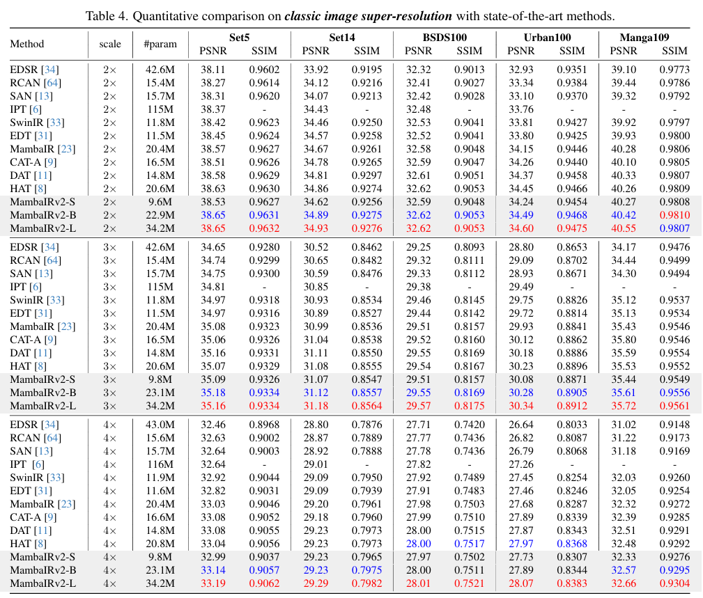
</p>
</details>


<details>
<summary>Evaluation on Lightweight SR (click to expand)</summary>

<p align="center">
  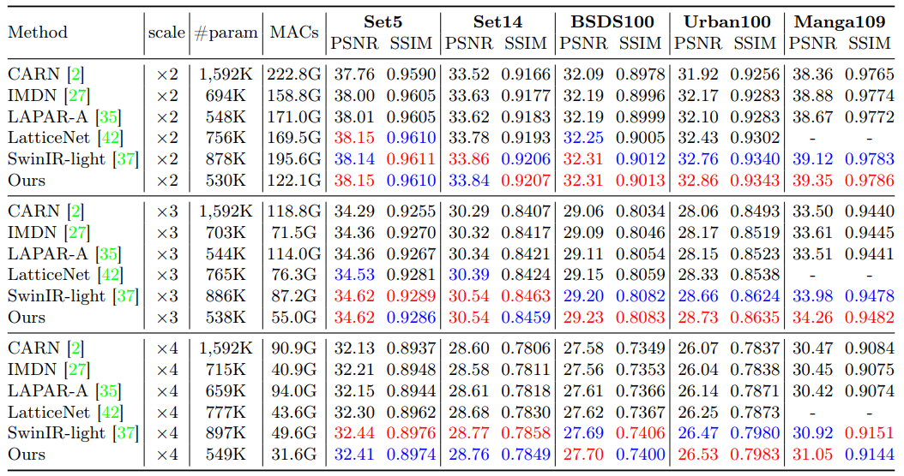
</p>
</details>


<details>
<summary>Evaluation on Gaussian Color Image Denoising (click to expand)</summary>

<p align="center">
  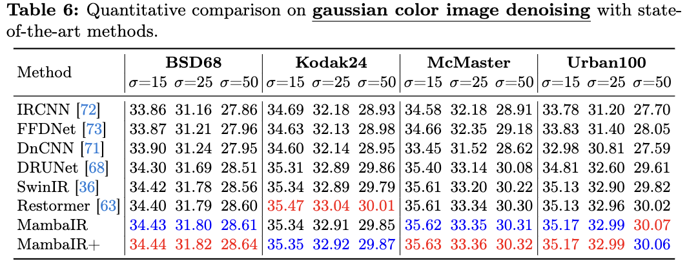
</p>
</details>


<details>
<summary>Evaluation on JPEG CAR (click to expand)</summary>

<p align="center">
  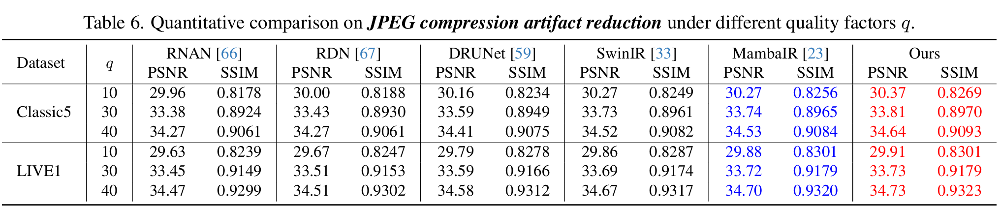
</p>

</details>


<details>
<summary>Evaluation on Effective Receptive Filed (click to expand)</summary>

<p align="center">
  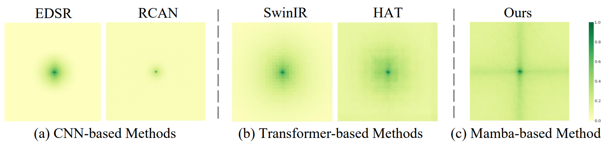
</p>

</details>


## <a name="installation"></a> :wrench: Installation

This codebase was tested with the following environment configurations. It may work with other versions.

- Ubuntu 20.04
- CUDA 11.7
- Python 3.9
- PyTorch 2.0.1 + cu117

The following give three possible solution to install the mamba-related libraries.

### Previous installation
To use the selective scan with efficient hard-ware design, the `mamba_ssm` library is needed to install with the folllowing command.

```
pip install causal_conv1d==1.0.0
pip install mamba_ssm==1.0.1
```

One can also create a new anaconda environment, and then install necessary python libraries with this [requirement.txt](https://drive.google.com/file/d/1SXtjaYDRN53Mz4LsCkgcL3wV23cOa8_P/view?usp=sharing) and the following command: 
```
conda install --yes --file requirements.txt
```

### Updated installation 

One can also reproduce the conda environment with the following simple commands (cuda-11.7 is used, you can modify the yaml file for your cuda version):

```
cd ./MambaIR
conda env create -f environment.yaml
conda activate mambair
```

### Backup  installation 

If you encounter difficulties installing `causal_conv1d` or `mamba_ssm`, e.g. the network can't link to github, it's recommended to use an **offline whl install**.


## Datasets

The datasets used in our training and testing are orgnized as follows: 


| Task                                          |                         Training Set                         |                         Testing Set                          |                        Visual Results(v2)                        |
| :-------------------------------------------- | :----------------------------------------------------------: | :----------------------------------------------------------: | :----------------------------------------------------------: |
| image SR                                      | [DIV2K](https://data.vision.ee.ethz.ch/cvl/DIV2K/) (800 training images) +  [Flickr2K](https://cv.snu.ac.kr/research/EDSR/Flickr2K.tar) (2650 images) [complete dataset DF2K [download](https://drive.google.com/file/d/1TubDkirxl4qAWelfOnpwaSKoj3KLAIG4/view?usp=share_link)] | Set5 + Set14 + BSD100 + Urban100 + Manga109 [[download](https://drive.google.com/file/d/1n-7pmwjP0isZBK7w3tx2y8CTastlABx1/view?usp=sharing)] | [Google Drive]() |
| gaussian color image denoising                          | [DIV2K](https://data.vision.ee.ethz.ch/cvl/DIV2K/) (800 training images) +  [Flickr2K](https://cv.snu.ac.kr/research/EDSR/Flickr2K.tar) (2650 images) + [BSD500](http://www.eecs.berkeley.edu/Research/Projects/CS/vision/grouping/BSR/BSR_bsds500.tgz) (400 training&testing images) + [WED](http://ivc.uwaterloo.ca/database/WaterlooExploration/exploration_database_and_code.rar)(4744 images) [complete dataset DFWB_RGB [download](https://drive.google.com/file/d/1jPgG_URDQZ4kyXaMMXJ8AZ8jEErCdKuM/view?usp=share_link)] | CBSD68 + Kodak24 + McMaster + Urban100  [[download](https://drive.google.com/file/d/1baLpOjNlTCNbREUDAZf9Lso6YCeUOQER/view?usp=sharing)] | [Google Drive]() |
| real image denoising                          | [SIDD](https://www.eecs.yorku.ca/~kamel/sidd/) (320 training images) [complete dataset SIDD [download](https://drive.google.com/drive/folders/1L_8ig1P71ikzf8PHGs60V6dZ2xoCixaC?usp=share_link)] | SIDD + DND [[download](https://drive.google.com/file/d/1Vuu0uhm_-PAG-5UPI0bPIaEjSfrSvsTO/view?usp=share_link)] | [Google Drive]() |
| grayscale JPEG compression artifact reduction | [DIV2K](https://data.vision.ee.ethz.ch/cvl/DIV2K/) (800 training images) +  [Flickr2K](https://cv.snu.ac.kr/research/EDSR/Flickr2K.tar) (2650 images) + [BSD500](http://www.eecs.berkeley.edu/Research/Projects/CS/vision/grouping/BSR/BSR_bsds500.tgz) (400 training&testing images) + [WED](http://ivc.uwaterloo.ca/database/WaterlooExploration/exploration_database_and_code.rar)(4744 images) [complete dataset DFWB_CAR [download](https://drive.google.com/file/d/1IASyJRsX9CKBE0i5iSJMelIr_a6U5Qcd/view?usp=share_link)] | Classic5 + LIVE1 [[download](https://drive.google.com/file/d/1KJ1ArYxRubRAWP1VgONf6rly1DwiRnzZ/view?usp=sharing)] | [Google Drive]() |


## <a name="training"></a>  :hourglass: Training

### Train on SR

1. Please download the corresponding training datasets and put them in the folder `datasets/DF2K`. Download the testing datasets and put them in the folder `datasets/SR`.

2. Follow the instructions below to begin training our model.

```
# Claissc SR task (Base model as default), cropped input=64×64, 8 GPUs, batch size=4 per GPU
python -m torch.distributed.launch --nproc_per_node=8 --master_port=1234 basicsr/train.py -opt options/train/mambairv2/train_MambaIRv2_SR_x2.yml --launcher pytorch
python -m torch.distributed.launch --nproc_per_node=8 --master_port=1234 basicsr/train.py -opt options/train/mambairv2/train_MambaIRv2_SR_x3.yml --launcher pytorch
python -m torch.distributed.launch --nproc_per_node=8 --master_port=1234 basicsr/train.py -opt options/train/mambairv2/train_MambaIRv2_SR_x4.yml --launcher pytorch

# for training our Small or Large model, use the following command
python -m torch.distributed.launch --nproc_per_node=8 --master_port=1234 basicsr/train.py -opt options/train/mambairv2/train_MambaIRv2_SRSmall_x4.yml --launcher pytorch
python -m torch.distributed.launch --nproc_per_node=8 --master_port=1234 basicsr/train.py -opt options/train/mambairv2/train_MambaIRv2_SRLarge_x4.yml --launcher pytorch
```

```
# Lightweight SR task, cropped input=64×64, 2 GPUs, batch size=16 per GPU
python -m torch.distributed.launch --nproc_per_node=2 --master_port=1234 basicsr/train.py -opt options/train/mambairv2/train_MambaIRv2_lightSR_x2.yml --launcher pytorch
python -m torch.distributed.launch --nproc_per_node=2 --master_port=1234 basicsr/train.py -opt options/train/mambairv2/train_MambaIRv2_lightSR_x3.yml --launcher pytorch
python -m torch.distributed.launch --nproc_per_node=2 --master_port=1234 basicsr/train.py -opt options/train/mambairv2/train_MambaIRv2_lightSR_x4.yml --launcher pytorch
```


1. Run the script then you can find the generated experimental logs in the folder experiments.

### Train on Gaussian Color Image Denosing


1. Download the corresponding training datasets [here](#datasets) and put them in the folder `./datasets/DFWB_RGB`. Download the testing datasets and put them in the folder `./datasets/ColorDN`.


2. Follow the instructions below to begin training:


```
# train on denosing15
python -m torch.distributed.launch --nproc_per_node=8 --master_port=2414 basicsr/train.py -opt options/train/mambairv2/train_MambaIRv2_ColorDN_level15.yml --launcher pytorch
```


3. Run the script then you can find the generated experimental logs in the folder `./experiments`.


### Train on JPEG Compression Artifact Reduction


1. Download the corresponding training datasets [here](#datasets) and put them in the folder `./datasets/DFWB_CAR`. Download the testing datasets and put them in the folder `./datasets/JPEG_CAR`.


2. Follow the instructions below to begin training:


```
# train on jpeg10
python -m torch.distributed.launch --nproc_per_node=8 --master_port=2414 basicsr/train.py -opt options/train/mambairv2/train_MambaIRv2_CAR_q10.yml --launcher pytorch

# train on jpeg30
python -m torch.distributed.launch --nproc_per_node=8 --master_port=2414 basicsr/train.py -opt options/train/mambairv2/train_MambaIRv2_CAR_q30.yml --launcher pytorch

# train on jpeg40
python -m torch.distributed.launch --nproc_per_node=8 --master_port=2414 basicsr/train.py -opt options/train/mambairv2/train_MambaIRv2_CAR_q40.yml --launcher pytorch
```

3. Run the script then you can find the generated experimental logs in the folder `./experiments`.


## <a name="testing"></a> :smile: Testing

### Test on SR

1. Please download the corresponding testing datasets and put them in the folder datasets/SR. Download the corresponding models and put them in the folder `experiments/pretrained`.

2. Follow the instructions below to begin testing our MambaIRv2 model.
```
# test for image SR (we use the Base model as default). 
python basicsr/test.py -opt options/test/mambairv2/test_MambaIRv2_SR_x2.yml
python basicsr/test.py -opt options/test/mambairv2/test_MambaIRv2_SR_x3.yml
python basicsr/test.py -opt options/test/mambairv2/test_MambaIRv2_SR_x4.yml

# if you want to test our Small or Large model, you can use the following command
python basicsr/test.py -opt options/test/mambairv2/test_MambaIRv2_SRSmall_x4.yml
python basicsr/test.py -opt options/test/mambairv2/test_MambaIRv2_SRLarge_x4.yml
```

```
# test for lightweight image SR. 
python basicsr/test.py -opt options/test/mambairv2/test_MambaIRv2_lightSR_x2.yml
python basicsr/test.py -opt options/test/mambairv2/test_MambaIRv2_lightSR_x3.yml
python basicsr/test.py -opt options/test/mambairv2/test_MambaIRv2_lightSR_x4.yml
```


### Test on Gaussian Color Image Denoising

1. Please download the corresponding testing datasets and put them in the folder `datasets/ColorDN`. 

2. Download the corresponding models and put them in the folder `experiments/pretrained_models`.

3. Follow the instructions below to begin testing our model.

```
# test on denosing15
python basicsr/test.py -opt options/test/mambairv2/test_MambaIRv2_ColorDN_level15.yml
```


### Test on JPEG Compression Artifact Reduction
1. Please download the corresponding testing datasets and put them in the folder `datasets/JPEG_CAR`. 

2. Download the corresponding models and put them in the folder `experiments/pretrained_models`.

3. Follow the instructions below to begin testing our model.

```
# test on jpeg10
python basicsr/test.py -opt options/test/mambairv2/test_MambaIRv2_CAR_q10.yml

# test on jpeg30
python basicsr/test.py -opt options/test/mambairv2/test_MambaIRv2_CAR_q30.yml

# test on jpeg40
python basicsr/test.py -opt options/test/mambairv2/test_MambaIRv2_CAR_q40.yml
```


## <a name="cite"></a> 🥰 Citation

Please cite us if our work is useful for your research.

```
@inproceedings{guo2025mambair,
  title={MambaIR: A simple baseline for image restoration with state-space model},
  author={Guo, Hang and Li, Jinmin and Dai, Tao and Ouyang, Zhihao and Ren, Xudong and Xia, Shu-Tao},
  booktitle={European Conference on Computer Vision},
  pages={222--241},
  year={2024},
  organization={Springer}
}
```

```
@article{guo2024mambairv2,
  title={MambaIRv2: Attentive State Space Restoration},
  author={Guo, Hang and Guo, Yong and Zha, Yaohua and Zhang, Yulun and Li, Wenbo and Dai, Tao and Xia, Shu-Tao and Li, Yawei},
  journal={arXiv preprint arXiv:2411.15269},
  year={2024}
}
```

## License

This project is released under the [Apache 2.0 license](LICENSE).

## Acknowledgement

This code is based on [BasicSR](https://github.com/XPixelGroup/BasicSR), [ART](https://github.com/gladzhang/ART) ,and [VMamba](https://github.com/MzeroMiko/VMamba). Thanks for their awesome work.

## Contact

If you have any questions, feel free to approach me at cshguo@gmail.com

